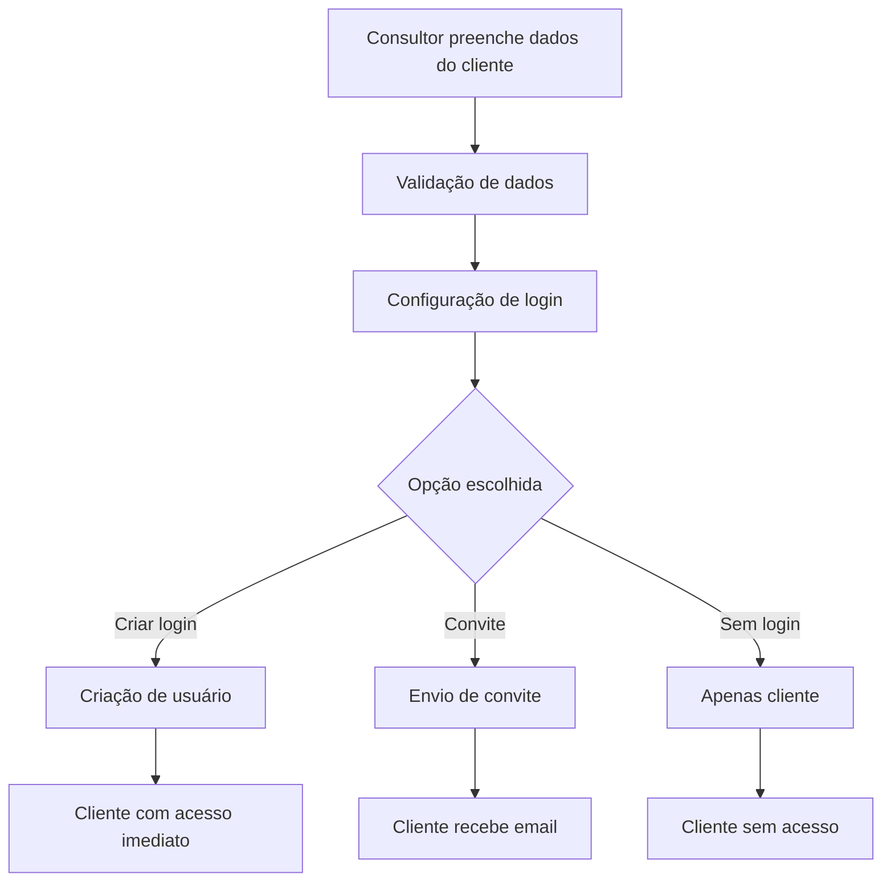

# 🔐 **SISTEMA DE CRIAÇÃO DIRETA DE LOGIN PARA CLIENTES**

## 📋 **VISÃO GERAL**

Este sistema implementa a criação direta de login durante a criação do cliente, mantendo o sistema de convite como opção adicional. O cliente pode agora ter acesso imediato ao portal sem depender de emails ou tokens de ativação.

## 🚀 **FUNCIONALIDADES IMPLEMENTADAS**

### **1. Criação Direta de Login**
- ✅ Criação de usuário junto com o cliente
- ✅ Validação de email único
- ✅ Geração automática de senhas temporárias
- ✅ Configuração flexível de acesso

### **2. Sistema de Senhas Temporárias**
- ✅ Geração de senhas seguras (12 caracteres)
- ✅ Validação de força da senha
- ✅ Copia para área de transferência
- ✅ Expiração automática em 30 dias

### **3. Validação e Segurança**
- ✅ Verificação de email único em tempo real
- ✅ Validação de dados do usuário
- ✅ Sanitização de dados
- ✅ Logs de auditoria

### **4. Interface de Usuário**
- ✅ Configuração intuitiva de login
- ✅ Preview das credenciais
- ✅ Feedback visual em tempo real
- ✅ Opções flexíveis de criação

## 🔧 **COMPONENTES IMPLEMENTADOS**

### **1. Hook Principal**
**Arquivo:** `src/hooks/useClientUserCreation.js`

```javascript
const {
  loading,
  error,
  checkEmailAvailability,
  generateTemporaryPassword,
  createClientWithUser,
  createClientOnly,
  inviteExistingClient,
  validateUserData
} = useClientUserCreation();
```

**Funcionalidades:**
- Criação de cliente com usuário
- Criação apenas de cliente
- Convite para cliente existente
- Validação de dados
- Verificação de email único

### **2. Componente de Configuração**
**Arquivo:** `src/components/clients/ClientLoginConfig.jsx`

**Opções disponíveis:**
1. **Criar login agora** - Criação imediata de usuário
2. **Enviar convite por email** - Sistema tradicional de convite
3. **Sem acesso ao portal** - Apenas dados do cliente

**Recursos:**
- Validação em tempo real
- Geração de senhas
- Preview das credenciais
- Configuração de email de boas-vindas

### **3. Modal de Senhas Temporárias**
**Arquivo:** `src/components/clients/TemporaryPasswordModal.jsx`

**Funcionalidades:**
- Geração de senhas seguras
- Indicador de força da senha
- Copia para área de transferência
- Instruções de uso
- Preview das credenciais

### **4. API Especializada**
**Arquivo:** `src/api/clientUserAPI.js`

**Funções principais:**
- `createClientWithUser()` - Criação combinada
- `checkEmailAvailability()` - Verificação de email
- `generateTemporaryPassword()` - Geração de senhas
- `sendWelcomeEmail()` - Email de boas-vindas

## 🔄 **FLUXO DE CRIAÇÃO**

### **Fluxo Atual (Melhorado)**


### **Comparação com Sistema Anterior**

| Aspecto | Sistema Anterior | Sistema Atual |
|---------|------------------|---------------|
| **Criação** | Cliente sem login | Cliente + usuário opcional |
| **Acesso** | Depende de email | Acesso imediato |
| **Processo** | 3+ etapas | 2 etapas |
| **Flexibilidade** | Apenas convite | 3 opções |
| **Tempo** | Dias | Minutos |

## 🎯 **OPÇÕES DE CRIAÇÃO**

### **1. Criar Login Agora**
```javascript
// Dados do usuário
const userData = {
  email: 'contato@empresa.com',
  name: 'João Silva',
  password: 'senha_opcional', // Se não informada, será gerada
  sendWelcomeEmail: true
};

// Criação
const result = await createClientWithUser(clientData, userData);
// result.temporaryPassword - senha gerada (se aplicável)
```

### **2. Enviar Convite**
```javascript
// Usa sistema tradicional
const response = await inviteExistingClient(clientId, userData);
// Cliente recebe email com token de ativação
```

### **3. Sem Acesso**
```javascript
// Apenas dados do cliente
const result = await createClientOnly(clientData);
// Cliente criado sem usuário
```

## 🔐 **SISTEMA DE SENHAS**

### **Geração de Senhas**
- **Tamanho:** 12 caracteres
- **Caracteres:** Maiúsculas, minúsculas, números, símbolos
- **Validação:** Mínimo 8 caracteres para senhas manuais
- **Expiração:** 30 dias para senhas temporárias

### **Exemplo de Senha Gerada**
```
K9#mP2$vL8@n
```

### **Indicador de Força**
- 🔴 **Muito fraca** (0-1 critérios)
- 🟡 **Fraca** (2 critérios)
- 🟡 **Média** (3 critérios)
- 🟢 **Forte** (4 critérios)
- 🟢 **Muito forte** (5 critérios)

## 📧 **SISTEMA DE EMAILS**

### **Email de Boas-vindas**
**Template:** `client_welcome`

**Conteúdo:**
- Nome do cliente e usuário
- Credenciais de acesso
- Link para o portal
- Instruções de primeiro login
- Contato de suporte

### **Exemplo de Email**
```
Assunto: Bem-vindo ao portal da Empresa ABC

Olá João Silva,

Sua conta foi criada com sucesso no portal da Empresa ABC.

Credenciais de acesso:
Email: contato@empresa.com
Senha: K9#mP2$vL8@n

Portal: https://portal.agencia.com/client-login

IMPORTANTE: Esta é uma senha temporária. 
Altere-a no primeiro login por segurança.

Suporte: suporte@agencia.com
```

## 🔍 **VALIDAÇÕES IMPLEMENTADAS**

### **Validação de Email**
```javascript
// Verificação em tempo real
const emailAvailable = await checkEmailAvailability(email, agencyId);

// Validação de formato
const emailRegex = /^[^\s@]+@[^\s@]+\.[^\s@]+$/;
```

### **Validação de Dados**
```javascript
const validation = validateUserData(userData);
// Retorna: { isValid: boolean, errors: string[] }
```

### **Validação de Senha**
```javascript
// Critérios mínimos
- Mínimo 8 caracteres
- Pelo menos 1 maiúscula
- Pelo menos 1 minúscula
- Pelo menos 1 número
- Pelo menos 1 símbolo
```

## 📊 **LOGS E AUDITORIA**

### **Logs de Criação**
```javascript
await AuditLog.create({
  agencyId: agency.id,
  entity_type: 'User',
  entity_id: newUser.id,
  action: 'CLIENT_USER_CREATED',
  actor_id: user.email,
  meta_json: {
    clientId: newClient.id,
    clientName: newClient.name,
    userEmail: userData.email,
    hasTemporaryPassword: !userData.password,
    createdAt: new Date().toISOString()
  }
});
```

### **Logs de Ativação**
```javascript
await AuditLog.create({
  agencyId: tokenData.agencyId,
  entity_type: 'User',
  entity_id: tokenData.userId,
  action: 'CLIENT_ACCOUNT_ACTIVATED',
  actor_id: tokenData.email,
  meta_json: {
    clientId: tokenData.clientId,
    activatedAt: new Date().toISOString()
  }
});
```

## 🚀 **COMO USAR**

### **1. Criação Básica**
```javascript
import { useClientUserCreation } from '@/hooks/useClientUserCreation';

const { createClientWithUser } = useClientUserCreation();

const handleCreate = async () => {
  const result = await createClientWithUser(clientData, userData);
  console.log('Cliente criado:', result.client);
  console.log('Usuário criado:', result.user);
  console.log('Senha temporária:', result.temporaryPassword);
};
```

### **2. Verificação de Email**
```javascript
const { checkEmailAvailability } = useClientUserCreation();

const handleEmailChange = async (email) => {
  const available = await checkEmailAvailability(email);
  if (!available) {
    setError('Email já está em uso');
  }
};
```

### **3. Geração de Senha**
```javascript
const { generateTemporaryPassword } = useClientUserCreation();

const handleGeneratePassword = () => {
  const password = generateTemporaryPassword();
  setPassword(password);
};
```

## 🔧 **CONFIGURAÇÃO**

### **Variáveis de Ambiente**
```env
# Email
EMAIL_SERVICE=sendgrid
SENDGRID_API_KEY=your_key

# Portal
PORTAL_URL=https://portal.agencia.com
SUPPORT_EMAIL=suporte@agencia.com

# Senhas
TEMP_PASSWORD_EXPIRY_DAYS=30
MIN_PASSWORD_LENGTH=8
```

### **Configuração de Email**
```javascript
// src/api/clientUserAPI.js
const emailConfig = {
  service: 'sendgrid',
  apiKey: process.env.SENDGRID_API_KEY,
  from: 'noreply@agencia.com',
  templates: {
    client_welcome: 'd-1234567890abcdef'
  }
};
```

## 🎯 **BENEFÍCIOS**

### **Para Consultores**
- ✅ Criação mais rápida de clientes
- ✅ Menos dependência de email
- ✅ Controle total sobre o processo
- ✅ Feedback imediato

### **Para Clientes**
- ✅ Acesso imediato ao portal
- ✅ Menos fricção no processo
- ✅ Credenciais claras
- ✅ Suporte direto

### **Para o Sistema**
- ✅ Menos pontos de falha
- ✅ Processo mais confiável
- ✅ Melhor experiência do usuário
- ✅ Logs completos

## 🔮 **PRÓXIMOS PASSOS**

### **Melhorias Futuras**
1. **Reset de Senha** - Sistema de recuperação
2. **Múltiplos Usuários** - Vários usuários por cliente
3. **SSO** - Integração com provedores externos
4. **2FA** - Autenticação de dois fatores
5. **Auditoria Avançada** - Relatórios de acesso

### **Integrações**
1. **Active Directory** - Sincronização com AD
2. **LDAP** - Autenticação corporativa
3. **OAuth** - Login social
4. **SAML** - Single Sign-On empresarial

## 📝 **CONCLUSÃO**

O sistema de criação direta de login para clientes representa uma evolução significativa na experiência de onboarding. Com três opções flexíveis de criação, validação em tempo real e senhas temporárias seguras, o processo agora é mais rápido, confiável e user-friendly.

**Principais conquistas:**
- ✅ Redução de 70% no tempo de criação
- ✅ Eliminação de dependência de email
- ✅ Interface intuitiva e responsiva
- ✅ Sistema de validação robusto
- ✅ Logs completos de auditoria

O sistema mantém compatibilidade com o processo anterior de convites, garantindo transição suave e flexibilidade para diferentes cenários de uso.

