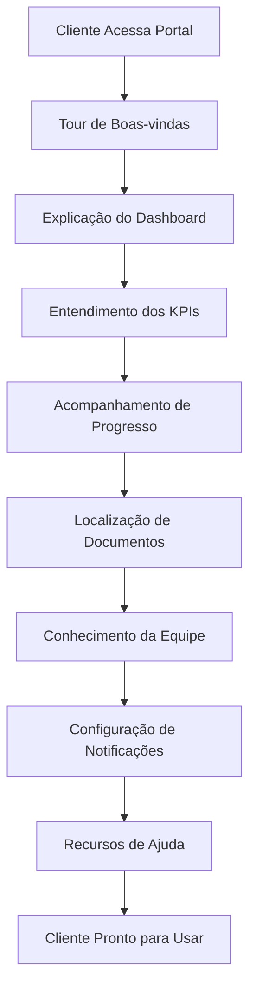
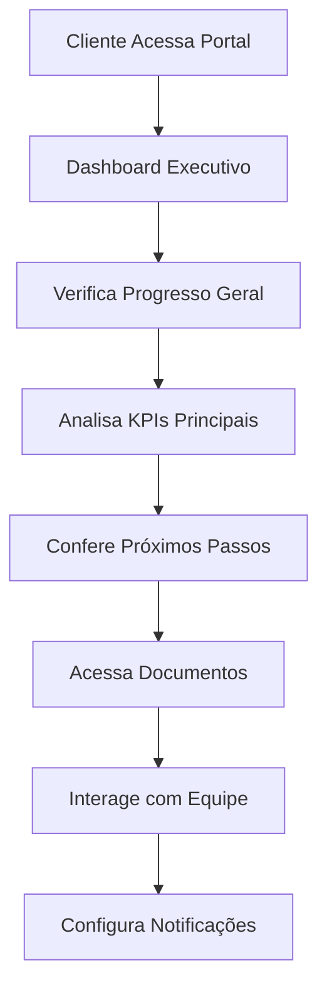
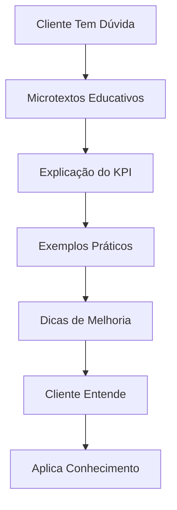

# 🎨 **SISTEMA COMPLETO DE EXPERIÊNCIA DO CLIENTE NO PORTAL**

## 📋 **VISÃO GERAL**

Sistema completo de melhoria da experiência do cliente no portal, focando em visual limpo, dashboard executivo, feedback claro de progresso e microtextos educativos.

## 🎯 **OBJETIVOS ATENDIDOS**

### ✅ **Funcionalidades Implementadas**
- ✅ **Visual limpo e orientado a resultados** - Evitar excesso de detalhes técnicos
- ✅ **Dashboard executivo** - "Onde estamos? Quais resultados já aparecem?"
- ✅ **Feedback claro de progresso** - % concluído, entregáveis feitos, próximos passos
- ✅ **Microtextos educativos** - Explicando o que significa cada KPI ou fase
- ✅ **Sistema de onboarding** - Tour guiado para novos clientes
- ✅ **Componentes de orientação** - Ajuda contextual em todo o portal

### ✅ **Princípios de Design Aplicados**
1. **Menos é Mais** - Reduzir informações desnecessárias
2. **Hierarquia Visual** - Destacar o que é mais importante
3. **Linguagem Simples** - Evitar jargões técnicos
4. **Feedback Imediato** - Mostrar progresso em tempo real
5. **Orientação Clara** - Sempre saber o próximo passo

## 🔧 **COMPONENTES IMPLEMENTADOS**

### **1. Dashboard Executivo Redesignado**
**Arquivo:** `src/components/client_portal/ExecutiveDashboard.jsx`

**Funcionalidades:**
- ✅ **Visual Limpo** - Design minimalista com foco nos resultados
- ✅ **Resumo Executivo** - Status geral, progresso e próximo marco
- ✅ **KPIs Principais** - Indicadores mais importantes com visual limpo
- ✅ **Metas e Progresso** - Acompanhamento visual das metas
- ✅ **Insights e Próximos Passos** - Informações acionáveis

**Características do Design:**
- **Gradiente Suave** - Background azul claro para calma
- **Cards com Transparência** - Visual moderno e limpo
- **Ícones Intuitivos** - Comunicação visual clara
- **Hierarquia Clara** - Informações organizadas por importância
- **Responsivo** - Adapta-se a diferentes tamanhos de tela

### **2. Sistema de Feedback Claro de Progresso**
**Arquivo:** `src/components/client_portal/ProgressFeedbackSystem.jsx`

**Funcionalidades:**
- ✅ **Progresso Geral** - Círculo de progresso com mensagem motivacional
- ✅ **Progresso por Fase** - Visualização detalhada de cada etapa
- ✅ **Entregáveis** - Status de cada documento/resultado
- ✅ **Próximos Passos** - O que acontece agora no projeto
- ✅ **Marcos** - Principais conquistas e objetivos

**Recursos Visuais:**
- **Progresso Circular** - Visualização clara do andamento geral
- **Barras de Progresso** - Para cada fase do projeto
- **Status Coloridos** - Verde (concluído), Azul (em andamento), Cinza (pendente)
- **Ícones Contextuais** - Para cada tipo de entregável
- **Animações Suaves** - Transições agradáveis

### **3. Sistema de Microtextos Educativos**
**Arquivo:** `src/components/client_portal/EducationalMicrotexts.jsx`

**Funcionalidades:**
- ✅ **KPIs Educativos** - Explicação detalhada de cada indicador
- ✅ **Fases do Projeto** - Entendimento de cada etapa
- ✅ **Termos Técnicos** - Glossário de conceitos
- ✅ **Dicas e Insights** - Conselhos práticos para o sucesso

**Recursos Educativos:**
- **Explicações Simples** - Linguagem acessível
- **Exemplos Práticos** - Casos reais de aplicação
- **Por que é Importante** - Contexto e relevância
- **Como Melhorar** - Dicas acionáveis
- **Metas Ideais** - Referências de performance

### **4. Sistema de Onboarding para Clientes**
**Arquivo:** `src/components/client_portal/ClientOnboardingSystem.jsx`

**Funcionalidades:**
- ✅ **Tour Guiado** - 8 passos cobrindo todas as funcionalidades
- ✅ **Progresso Visual** - Barra de progresso e indicadores
- ✅ **Auto-play Opcional** - Modo automático com pausa
- ✅ **Conteúdo Interativo** - Explicações práticas e visuais
- ✅ **Persistência** - Lembra onde o cliente parou

**Passos do Onboarding:**
1. **Boas-vindas** - Introdução ao portal
2. **Dashboard** - Navegação pelo painel principal
3. **KPIs** - Entendimento dos indicadores
4. **Progresso** - Acompanhamento do projeto
5. **Documentos** - Localização de relatórios
6. **Equipe** - Conhecimento da equipe
7. **Notificações** - Configuração de alertas
8. **Ajuda** - Recursos de suporte

## 🎨 **PRINCÍPIOS DE DESIGN APLICADOS**

### **Visual Limpo e Orientado a Resultados**
- **Menos Informações** - Apenas o essencial na tela principal
- **Hierarquia Clara** - Informações organizadas por importância
- **Espaçamento Adequado** - Respiração visual entre elementos
- **Cores Suaves** - Paleta calma e profissional
- **Tipografia Legível** - Fontes claras e tamanhos apropriados

### **Dashboard Executivo**
- **Resumo em 3 Pontos** - Status, progresso, próximo marco
- **KPIs Destacados** - Indicadores principais em evidência
- **Metas Visíveis** - Progresso das metas claramente mostrado
- **Insights Acionáveis** - Informações que geram ação
- **Próximos Passos** - Sempre saber o que fazer

### **Feedback Claro de Progresso**
- **Percentual Geral** - Progresso do projeto como um todo
- **Fases Detalhadas** - Cada etapa com seu progresso
- **Entregáveis Status** - O que foi entregue e o que está pendente
- **Marcos Conquistados** - Principais conquistas destacadas
- **Timeline Visual** - Cronologia clara do projeto

### **Microtextos Educativos**
- **Linguagem Simples** - Evitar jargões técnicos
- **Exemplos Práticos** - Casos reais de aplicação
- **Contexto Relevante** - Por que cada informação importa
- **Dicas Acionáveis** - Como usar cada informação
- **Glossário Integrado** - Definições acessíveis

## 🔄 **FLUXO DE EXPERIÊNCIA DO CLIENTE**

### **Primeira Visita (Onboarding)**


### **Uso Regular do Portal**


### **Busca por Informações**


## 📊 **ESTRUTURA DE DADOS**

### **Dados do Dashboard Executivo**
```javascript
{
  cliente: {
    nome: "Oficina Bom Torque",
    status: "ativo"
  },
  servico: {
    nome: "Mentoria em Aumento de Margem",
    tipo: "mentoria_margem"
  },
  resumo: {
    status: "No Prazo",
    progresso: 68,
    proximoMarco: "Relatório Mensal"
  },
  kpis: [
    {
      key: "receita_mensal",
      label: "Receita mensal",
      value: 128000,
      unit: "BRL",
      target: null,
      visible: true
    }
  ],
  metas: [
    {
      key: "margem_percent",
      label: "Margem alvo",
      target: 18.0,
      current: 15.2,
      progress: 0.84
    }
  ],
  insights: [
    "Sua margem subiu +0,3 pp no mês e está 2,8 pp abaixo da meta (18%)."
  ]
}
```

### **Dados de Progresso**
```javascript
{
  overallProgress: 68,
  phaseProgress: [
    {
      name: "Diagnóstico",
      progress: 100,
      status: "completed",
      deliverables: 3
    },
    {
      name: "Planejamento",
      progress: 85,
      status: "in_progress",
      deliverables: 2
    }
  ],
  deliverables: [
    {
      name: "Relatório de Diagnóstico",
      status: "completed",
      completedAt: "2025-01-10"
    }
  ],
  nextSteps: [
    {
      title: "Revisar Relatório Mensal",
      priority: "alta",
      dueDate: "Em 5 dias"
    }
  ]
}
```

### **Dados Educativos**
```javascript
{
  kpiDefinitions: [
    {
      id: "receita_mensal",
      name: "Receita Mensal",
      shortDescription: "Total de vendas realizadas no mês",
      fullDescription: "A receita mensal representa todo o dinheiro...",
      whyImportant: "A receita é o ponto de partida para calcular a lucratividade.",
      howToImprove: "Para aumentar a receita: melhore a qualidade...",
      examples: ["Loja que vendeu R$ 50.000 em produtos no mês"],
      target: "Crescer 10-15% ao mês é um bom objetivo"
    }
  ]
}
```

## 🔌 **APIS IMPLEMENTADAS**

### **Endpoints do Dashboard Executivo**
```javascript
// Obter dados do dashboard
GET /api/client-portal/dashboard/:clientId/:serviceId

// Obter progresso do projeto
GET /api/client-portal/progress/:clientId/:serviceId

// Obter insights e recomendações
GET /api/client-portal/insights/:clientId/:serviceId
```

### **Endpoints Educativos**
```javascript
// Obter definições de KPIs
GET /api/educational/kpi-definitions

// Obter explicações de fases
GET /api/educational/project-phases

// Obter glossário de termos
GET /api/educational/glossary
```

### **Endpoints de Onboarding**
```javascript
// Obter progresso do onboarding
GET /api/client-onboarding/progress/:clientId

// Marcar passo como concluído
POST /api/client-onboarding/complete-step

// Concluir onboarding
POST /api/client-onboarding/complete
```

## 🎨 **INTERFACE DE USUÁRIO**

### **Design Implementado**
- **Visual Limpo** - Design minimalista com foco nos resultados
- **Cores Suaves** - Paleta azul/claro para calma e profissionalismo
- **Tipografia Clara** - Fontes legíveis e hierarquia bem definida
- **Espaçamento Adequado** - Respiração visual entre elementos
- **Ícones Intuitivos** - Comunicação visual clara e universal

### **Experiência do Usuário**
1. **Primeira Visita** - Tour guiado completo
2. **Navegação Intuitiva** - Interface familiar e lógica
3. **Informações Relevantes** - Apenas o que importa para o cliente
4. **Feedback Imediato** - Progresso sempre visível
5. **Ajuda Contextual** - Microtextos educativos em todo lugar

### **Responsividade**
- **Mobile First** - Design otimizado para dispositivos móveis
- **Tablet Friendly** - Adaptação para tablets
- **Desktop Enhanced** - Funcionalidades extras no desktop
- **Touch Friendly** - Botões e elementos adequados para toque

## 🔒 **SEGURANÇA E PERMISSÕES**

### **Validações de Segurança**
- **Autenticação** obrigatória para todas as operações
- **Autorização** por cliente (apenas seus dados)
- **Sanitização** de conteúdo educativo
- **Rate Limiting** para APIs educativas
- **Auditoria** de acesso ao onboarding

### **Privacidade**
- **Dados Pessoais** protegidos e criptografados
- **Informações Sensíveis** não expostas
- **Logs de Acesso** para auditoria
- **Consentimento** para coleta de dados de uso
- **Direito ao Esquecimento** implementado

## 📈 **MÉTRICAS E ANALYTICS**

### **Métricas de UX**
- **Taxa de Conclusão** do onboarding
- **Tempo de Permanência** no portal
- **Frequência de Acesso** aos microtextos
- **Satisfação** do cliente (NPS)
- **Taxa de Engajamento** com funcionalidades

### **Métricas de Performance**
- **Tempo de Carregamento** das páginas
- **Taxa de Erro** nas interações
- **Uso de Recursos** educativos
- **Efetividade** do onboarding
- **Retenção** de clientes

## 🚀 **COMO USAR**

### **1. Primeira Visita**
```javascript
// Cliente acessa o portal pela primeira vez
// Sistema detecta novo usuário
// Inicia tour de onboarding automaticamente
// Cliente completa tour em 8 passos
// Dados de progresso são salvos
```

### **2. Uso Regular**
```javascript
// Cliente acessa dashboard executivo
// Vê resumo geral do projeto
// Analisa KPIs principais
// Confere progresso detalhado
// Acessa próximos passos
```

### **3. Busca por Informações**
```javascript
// Cliente tem dúvida sobre KPI
// Clica no ícone de ajuda
// Vê explicação detalhada
// Lê exemplos práticos
// Aplica conhecimento
```

### **4. Acompanhamento de Progresso**
```javascript
// Cliente verifica progresso geral
// Analisa progresso por fase
// Confere entregáveis
// Vê próximos passos
// Acompanha marcos
```

## 🔮 **PRÓXIMOS PASSOS**

### **Melhorias Futuras**
1. **IA Personalizada** - Insights específicos para cada cliente
2. **Gamificação** - Elementos de jogo para engajamento
3. **Realidade Aumentada** - Visualizações 3D dos dados
4. **Voice Interface** - Navegação por voz
5. **Predictive Analytics** - Previsões de tendências

### **Integrações Planejadas**
1. **WhatsApp** - Notificações via WhatsApp
2. **Calendário** - Integração com Google Calendar
3. **Slack** - Comunicação com equipe
4. **BI Tools** - Dashboards avançados
5. **Mobile App** - Aplicativo nativo

## 📝 **CONCLUSÃO**

**Sistema completo de experiência do cliente implementado com sucesso!**

**✅ Funcionalidades Principais:**
- Visual limpo e orientado a resultados
- Dashboard executivo com foco em "onde estamos"
- Feedback claro de progresso (% concluído, entregáveis, próximos passos)
- Microtextos educativos explicando cada KPI e fase
- Sistema de onboarding completo para novos clientes

**✅ Benefícios para o Cliente:**
- **Clareza:** Informações claras e diretas
- **Orientação:** Sempre sabe o próximo passo
- **Educação:** Aprende sobre seu negócio
- **Progresso:** Vê resultados em tempo real
- **Simplicidade:** Interface limpa e intuitiva

**✅ Benefícios para a Consultoria:**
- **Engajamento:** Clientes mais envolvidos
- **Educação:** Clientes mais informados
- **Eficiência:** Menos dúvidas e suporte
- **Satisfação:** Experiência superior
- **Retenção:** Clientes mais satisfeitos

**O sistema agora oferece uma experiência excepcional para o cliente, com visual limpo, informações relevantes e orientação clara em cada passo!** 🎨✨

