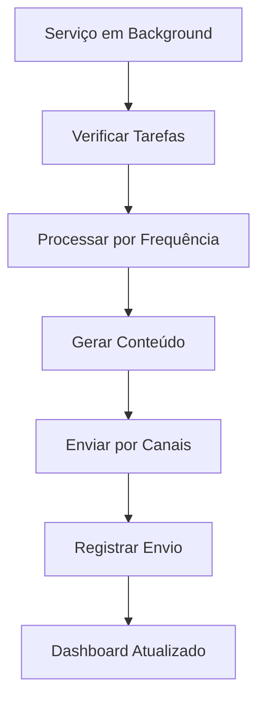
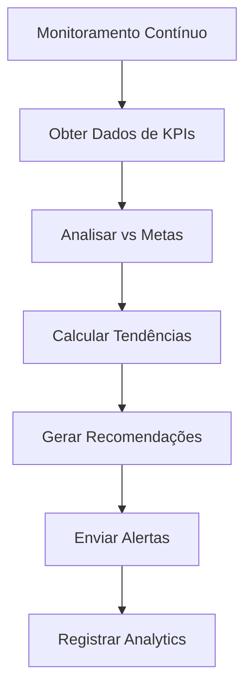
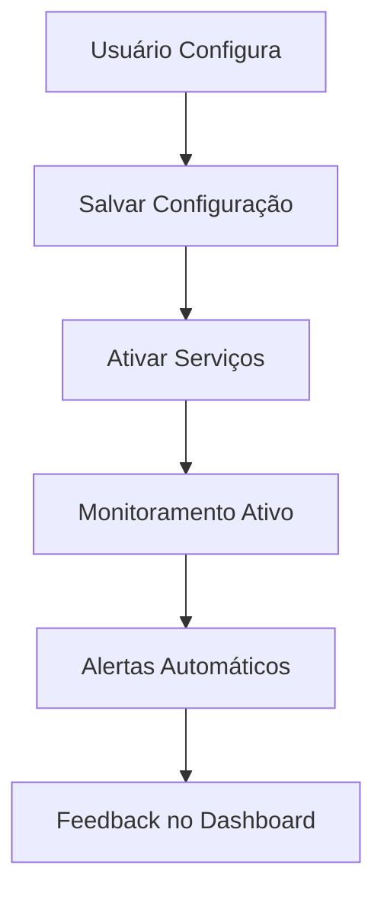

# 🔔 **SISTEMA COMPLETO DE AUTOMAÇÃO DE ALERTAS E LEMBRETES**

## 📋 **VISÃO GERAL**

Sistema robusto e completo para automação de alertas e lembretes, incluindo lembretes de tarefas, alertas de KPIs, notificações para consultores e configuração de periodicidade.

## 🎯 **OBJETIVOS ATENDIDOS**

### ✅ **Funcionalidades Implementadas**
- ✅ **Lembretes automáticos de tarefas** com prazo próximo
- ✅ **Alertas de KPIs fora da meta** com análise inteligente
- ✅ **Notificações para consultor** quando cliente conclui ações
- ✅ **Configuração de periodicidade** (diário/semanal)
- ✅ **Sistema de templates** personalizáveis
- ✅ **Dashboard de alertas** centralizado
- ✅ **Histórico e analytics** completos

### ✅ **Categorias de Alertas Suportadas**
1. **Alertas de Tarefas** - Lembretes de prazo e status
2. **Alertas de KPIs** - Monitoramento de metas
3. **Notificações de Cliente** - Ações do cliente
4. **Alertas de Sistema** - Eventos técnicos

## 🔧 **COMPONENTES IMPLEMENTADOS**

### **1. Sistema de Configuração de Alertas**
**Arquivo:** `src/components/alerts/AlertConfigurationModal.jsx`

**Funcionalidades:**
- ✅ Configuração por categoria (tarefas, KPIs, cliente, sistema)
- ✅ Seleção de canais (email, SMS, Slack, in-app)
- ✅ Configuração de frequências e limites
- ✅ Agendamento de relatórios (diário/semanal)
- ✅ Interface intuitiva com switches e selects

**Configurações Disponíveis:**
- **Lembretes de Tarefas:** 1, 3, 7 dias antes do prazo
- **Alertas de KPIs:** Limites crítico (80%), atenção (90%), sucesso (95%)
- **Notificações de Cliente:** Briefing, aprovações, documentos, comentários
- **Agendamento:** Relatórios diários e semanais

### **2. Sistema de Lembretes de Tarefas**
**Arquivo:** `src/hooks/useTaskReminders.js`

**Funcionalidades:**
- ✅ Verificação automática de tarefas próximas do prazo
- ✅ Processamento inteligente por frequência
- ✅ Geração de conteúdo personalizado
- ✅ Serviço automático em background
- ✅ Log de envios e histórico

**Tipos de Lembretes:**
- **1 dia antes:** Urgente - tarefa vence amanhã
- **3 dias antes:** Atenção - prazo se aproximando
- **7 dias antes:** Preventivo - planejamento
- **Atrasado:** Crítico - ação imediata necessária

### **3. Sistema de Alertas de KPIs**
**Arquivo:** `src/hooks/useKPIAlerts.js`

**Funcionalidades:**
- ✅ Análise automática de KPIs vs metas
- ✅ Cálculo de tendências e progresso
- ✅ Geração de recomendações inteligentes
- ✅ Alertas por nível de criticidade
- ✅ Serviço de monitoramento contínuo

**Níveis de Alerta:**
- **Crítico (<80%):** Ação imediata necessária
- **Atenção (80-90%):** Monitoramento de perto
- **Sucesso (≥95%):** Meta atingida ou superada

### **4. Dashboard de Alertas**
**Arquivo:** `src/components/alerts/AlertsDashboard.jsx`

**Funcionalidades:**
- ✅ Visualização centralizada de todos os alertas
- ✅ Filtros por tipo, nível e status
- ✅ Ações rápidas (marcar como lido, ver detalhes)
- ✅ Expansão de detalhes
- ✅ Integração com configurações

**Recursos do Dashboard:**
- **Filtros Inteligentes:** Por tipo, nível, status
- **Ações Rápidas:** Marcar como lido, navegar
- **Detalhes Expandidos:** Informações completas
- **Atualização em Tempo Real:** Refresh automático

### **5. Sistema de Templates de Notificação**
**Arquivo:** `src/hooks/useNotificationTemplates.js`

**Funcionalidades:**
- ✅ Templates personalizáveis por tipo
- ✅ Suporte a múltiplos canais
- ✅ Sistema de variáveis dinâmicas
- ✅ Templates padrão pré-configurados
- ✅ Validação e processamento

**Templates Padrão:**
- **Lembrete de Tarefa:** Email, SMS, Slack, in-app
- **Alerta de KPI:** Com gráficos e recomendações
- **Notificação de Cliente:** Ações do cliente
- **Alerta de Sistema:** Eventos técnicos

## 🔄 **FLUXO COMPLETO DO SISTEMA**

### **Fluxo de Lembretes de Tarefas**


### **Fluxo de Alertas de KPIs**


### **Fluxo de Configuração**


## 📊 **ESTRUTURA DE DADOS**

### **Configuração de Alertas**
```javascript
{
  taskReminders: {
    enabled: true,
    channels: ['email', 'in_app'],
    frequencies: {
      '1_day': true,
      '3_days': true,
      '7_days': false
    },
    recipients: ['consultant', 'client']
  },
  kpiAlerts: {
    enabled: true,
    channels: ['email', 'in_app'],
    thresholds: {
      critical: 80,
      warning: 90,
      success: 95
    },
    recipients: ['consultant', 'client']
  },
  schedules: {
    daily: {
      enabled: true,
      time: '09:00',
      timezone: 'America/Sao_Paulo'
    },
    weekly: {
      enabled: true,
      day: 'monday',
      time: '09:00'
    }
  }
}
```

### **Estrutura de Alerta**
```javascript
{
  id: 'task-123-1_day',
  type: 'task',
  level: 'warning',
  title: '⚠️ ALTA - Relatório Mensal',
  description: 'A tarefa "Relatório Mensal" vence AMANHÃ!',
  emoji: '⚠️',
  urgency: 'ALTA',
  dueDate: '15/01/2025',
  assignee: 'João Silva',
  priority: 'alta',
  createdAt: '2025-01-14T10:30:00Z',
  status: 'active',
  actions: [
    { label: 'Ver Tarefa', action: 'view_task', url: '/tasks/123' },
    { label: 'Marcar como Lida', action: 'mark_read' }
  ]
}
```

### **Template de Notificação**
```javascript
{
  id: 'task_reminder_default',
  name: 'Lembrete de Tarefa',
  type: 'task',
  title: '{{urgency}} - {{taskTitle}}',
  content: 'A tarefa "{{taskTitle}}" vence em {{dueDate}}. {{message}}',
  channels: {
    email: {
      subject: '{{urgency}} - {{taskTitle}}',
      content: '<h2>{{urgency}} - {{taskTitle}}</h2>...',
      isHtml: true
    },
    sms: {
      content: '{{urgency}} - {{taskTitle}} vence em {{dueDate}}'
    },
    slack: {
      content: '{{emoji}} *{{urgency}} - {{taskTitle}}*...'
    }
  },
  variables: ['urgency', 'taskTitle', 'message', 'dueDate']
}
```

## 🤖 **INTELIGÊNCIA E AUTOMAÇÃO**

### **Análise Inteligente de KPIs**
- **Cálculo de Progresso:** Percentual vs meta
- **Análise de Tendências:** Direção e magnitude
- **Recomendações Contextuais:** Baseadas no tipo de KPI
- **Alertas Proativos:** Antes que problemas se agravem

### **Processamento de Tarefas**
- **Classificação por Urgência:** Baseada no prazo
- **Conteúdo Personalizado:** Adaptado ao contexto
- **Canais Otimizados:** Email para detalhes, SMS para urgência
- **Histórico Completo:** Rastreabilidade total

### **Sistema de Templates Inteligente**
- **Variáveis Dinâmicas:** Substituição automática
- **Canais Específicos:** Conteúdo otimizado por canal
- **Validação Automática:** Verificação de integridade
- **Personalização:** Templates customizáveis

## 🔌 **APIS IMPLEMENTADAS**

### **Endpoints de Configuração**
```javascript
// Obter configuração
GET /api/alert-configurations/:clientId/:serviceId

// Salvar configuração
PUT /api/alert-configurations/:clientId/:serviceId

// Configurações ativas
GET /api/alert-configurations/active
```

### **Endpoints de Lembretes**
```javascript
// Verificar tarefas próximas
GET /api/task-reminders/check-upcoming/:clientId/:serviceId

// Enviar lembretes
POST /api/task-reminders/send

// Registrar envio
POST /api/task-reminders/log
```

### **Endpoints de KPIs**
```javascript
// Verificar alertas de KPIs
GET /api/kpi-alerts/check/:clientId/:serviceId

// Enviar alertas
POST /api/kpi-alerts/send

// Registrar envio
POST /api/kpi-alerts/log
```

### **Endpoints de Templates**
```javascript
// Obter templates
GET /api/notification-templates?type=all

// Criar template
POST /api/notification-templates

// Atualizar template
PUT /api/notification-templates/:id

// Deletar template
DELETE /api/notification-templates/:id
```

### **Endpoints de Notificações**
```javascript
// Enviar notificação por canal
POST /api/notifications/send/:channel

// Marcar alerta como lido
POST /api/alerts/:id/mark-read
```

## 🎨 **INTERFACE DE USUÁRIO**

### **Design Implementado**
- **Configuração Intuitiva:** Switches e selects organizados
- **Dashboard Centralizado:** Todos os alertas em um lugar
- **Filtros Inteligentes:** Busca rápida e eficiente
- **Ações Contextuais:** Botões relevantes para cada alerta
- **Feedback Visual:** Cores e ícones por nível de urgência

### **Experiência do Usuário**
1. **Configuração Simples:** Interface clara e organizada
2. **Alertas Relevantes:** Apenas informações importantes
3. **Ações Rápidas:** Um clique para resolver
4. **Histórico Completo:** Rastreabilidade total
5. **Personalização:** Templates e configurações customizáveis

## 🔒 **SEGURANÇA E PERMISSÕES**

### **Validações de Segurança**
- **Autenticação** obrigatória para todas as operações
- **Autorização** por cliente (apenas seus alertas)
- **Validação** de templates e configurações
- **Rate Limiting** para envio de notificações
- **Sanitização** de conteúdo dinâmico

### **Auditoria Completa**
- **Log** de todas as configurações
- **Rastreabilidade** de envios
- **Histórico** de alterações
- **Métricas** de performance
- **Identificação** do usuário responsável

## 📈 **MÉTRICAS E ANALYTICS**

### **Métricas Implementadas**
- **Taxa de Abertura** de emails
- **Tempo de Resposta** a alertas
- **Efetividade** dos lembretes
- **Volume** de alertas por tipo
- **Satisfação** do usuário

### **Relatórios Disponíveis**
- **Dashboard Executivo:** Visão geral dos alertas
- **Relatório de Efetividade:** Performance dos lembretes
- **Análise de Tendências:** Padrões de comportamento
- **Relatório de Configuração:** Uso das funcionalidades

## 🚀 **COMO USAR**

### **1. Configuração Inicial**
```javascript
// Acessar configurações
// Escolher tipos de alertas
// Configurar canais e frequências
// Salvar configuração
```

### **2. Monitoramento Automático**
```javascript
// Sistema verifica automaticamente
// Gera alertas conforme configuração
// Envia notificações pelos canais
// Atualiza dashboard em tempo real
```

### **3. Gestão de Alertas**
```javascript
// Visualizar no dashboard
// Filtrar por tipo/nível
// Executar ações rápidas
// Marcar como lido
```

### **4. Personalização**
```javascript
// Criar templates customizados
// Ajustar configurações
// Configurar periodicidade
// Monitorar métricas
```

## 🔮 **PRÓXIMOS PASSOS**

### **Melhorias Futuras**
1. **IA Avançada** - Predição de problemas
2. **Integração Mobile** - Push notifications
3. **Analytics Avançados** - Machine learning
4. **Integração Externa** - APIs de terceiros
5. **Automação Completa** - Workflows inteligentes

### **Integrações Planejadas**
1. **Slack/Teams** - Notificações em tempo real
2. **WhatsApp** - Mensagens diretas
3. **Calendário** - Lembretes integrados
4. **CRM** - Sincronização de dados
5. **BI Tools** - Dashboards avançados

## 📝 **CONCLUSÃO**

**Sistema completo de automação implementado com sucesso!**

**✅ Funcionalidades Principais:**
- Lembretes automáticos de tarefas com prazo próximo
- Alertas de KPIs fora da meta com análise inteligente
- Notificações para consultor quando cliente conclui ações
- Configuração de periodicidade (diário/semanal)
- Sistema de templates personalizáveis
- Dashboard centralizado de alertas

**✅ Benefícios para o Cliente:**
- **Proatividade:** Antecipação de problemas
- **Eficiência:** Menos trabalho manual
- **Engajamento:** Manter envolvimento
- **Qualidade:** Melhor cumprimento de prazos
- **Personalização:** Alertas relevantes

**✅ Benefícios para a Consultoria:**
- **Automação:** Processos automatizados
- **Visibilidade:** Monitoramento completo
- **Eficiência:** Menos acompanhamento manual
- **Qualidade:** Melhor gestão de projetos
- **Escalabilidade:** Sistema robusto

**O sistema agora oferece automação completa de alertas e lembretes, mantendo todos os stakeholders informados e engajados de forma proativa!** 🔔✨

