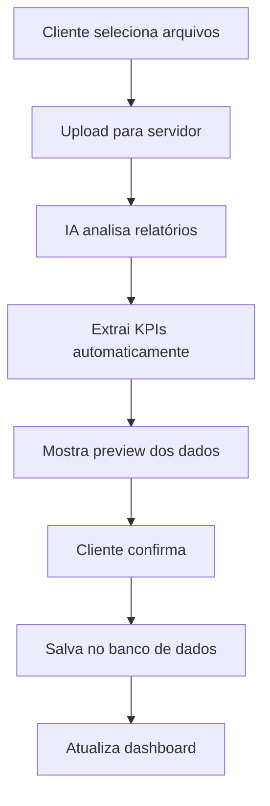
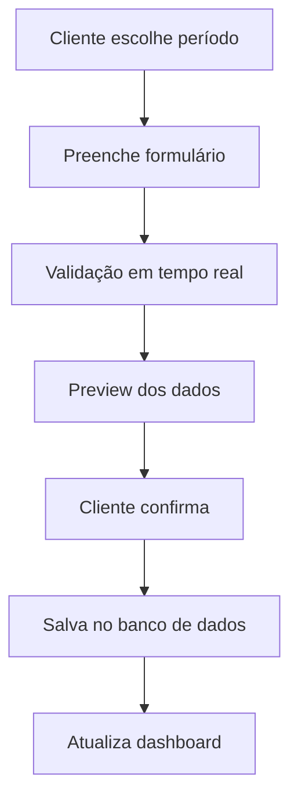

# 📊 **SISTEMA DE FONTES DE DADOS REAIS PARA DASHBOARD**

## 📋 **VISÃO GERAL**

Sistema completo para inserir dados financeiros reais no dashboard através de uploads de relatórios com análise de IA ou inserção manual de números.

## 🎯 **OBJETIVOS ATENDIDOS**

### ✅ **Funcionalidades Implementadas**
- ✅ Upload de relatórios financeiros (PDF, Excel, CSV)
- ✅ Análise de IA para extração automática de KPIs
- ✅ Interface de inserção manual de números
- ✅ Validação e confirmação de dados
- ✅ Armazenamento e histórico
- ✅ Integração completa com dashboard existente

### ✅ **Fontes de Dados Suportadas**
1. **Upload de Relatórios** - Análise automática com IA
2. **Inserção Manual** - Entrada direta de números
3. **Histórico** - Dados acumulados ao longo do tempo

## 🔧 **COMPONENTES IMPLEMENTADOS**

### **1. Sistema de Upload de Relatórios**
**Arquivo:** `src/components/client_portal/FinancialReportUploadModal.jsx`

**Funcionalidades:**
- Upload múltiplo de arquivos (PDF, Excel, CSV)
- Validação de tipos de arquivo
- Análise automática com IA
- Extração de KPIs com confiança
- Preview dos dados extraídos
- Confirmação antes de salvar

**Fluxo:**
1. **Upload** → Seleção de arquivos
2. **Análise** → IA processa os relatórios
3. **Extração** → KPIs identificados automaticamente
4. **Confirmação** → Usuário valida e salva

### **2. Interface de Inserção Manual**
**Arquivo:** `src/components/client_portal/ManualKPIsInputModal.jsx`

**Funcionalidades:**
- Formulário específico por tipo de serviço
- Validação em tempo real
- Formatação automática de valores
- Preview dos dados inseridos
- Validação de campos obrigatórios

**KPIs por Serviço:**
- **Diagnóstico Avulso:** Receita, Margem, Fluxo, Endividamento
- **Mentoria Margem:** Margem, Receita, Custos, Inadimplência
- **Gestão 360:** Fluxo, Inadimplência, Ciclo, Giro

### **3. Sistema de Armazenamento**
**Arquivo:** `src/hooks/useFinancialData.js`

**Funcionalidades:**
- Salvar dados extraídos de relatórios
- Salvar dados inseridos manualmente
- Obter dados para dashboard
- Histórico de dados por KPI
- Validação de dados
- Geração de insights

### **4. Gerenciador de Fontes**
**Arquivo:** `src/components/client_portal/DataSourceManager.jsx`

**Funcionalidades:**
- Interface unificada para escolher fonte
- Cards visuais para cada opção
- Informações sobre cada método
- Integração com modais

### **5. Integração com Dashboard**
**Arquivo:** `src/components/client_portal/ClientFinancialDashboard.jsx`

**Atualizações:**
- Botão "Inserir Dados" no header
- Modal de gerenciamento de fontes
- Recarregamento automático após inserção
- Integração com hooks de dados

## 🔄 **FLUXO COMPLETO DE DADOS**

### **Fluxo de Upload de Relatórios**


### **Fluxo de Inserção Manual**


## 📊 **ESTRUTURA DE DADOS**

### **Dados Extraídos de Relatórios**
```javascript
{
  confidence: 0.87,
  extractedKPIs: [
    {
      key: 'receita_mensal',
      label: 'Receita mensal',
      value: 128000,
      unit: 'BRL',
      confidence: 0.92,
      source: 'DRE - Linha 1',
      period: '2025-09'
    }
  ],
  insights: [
    'Margem operacional identificada em 15,2%, abaixo da meta de 18%'
  ],
  metadata: {
    analyzedAt: '2025-01-15T10:30:00Z',
    filesAnalyzed: 2,
    totalPages: 12,
    processingTime: '2.3s'
  }
}
```

### **Dados Inseridos Manualmente**
```javascript
{
  clientId: 'c1',
  serviceId: 's1',
  period: '2025-09',
  kpis: [
    {
      key: 'margem_percent',
      label: 'Margem (%)',
      unit: '%',
      value: 15.2,
      source: 'manual_input',
      inputBy: 'user@email.com',
      inputAt: '2025-01-15T10:30:00Z'
    }
  ],
  metadata: {
    inputMethod: 'manual',
    inputBy: 'user@email.com',
    inputAt: '2025-01-15T10:30:00Z',
    serviceType: 'mentoria_margem'
  }
}
```

## 🤖 **ANÁLISE DE IA**

### **Processo de Extração**
1. **Upload** → Arquivos enviados para servidor
2. **Processamento** → IA analisa conteúdo
3. **Identificação** → Localiza KPIs nos relatórios
4. **Extração** → Extrai valores e contextos
5. **Validação** → Calcula confiança de cada KPI
6. **Apresentação** → Mostra resultados para confirmação

### **Tipos de Relatórios Suportados**
- **PDF:** DRE, Balanço Patrimonial, Fluxo de Caixa
- **Excel:** Planilhas financeiras estruturadas
- **CSV:** Dados tabulares de sistemas contábeis

### **KPIs Identificados Automaticamente**
- **Receita mensal** (DRE, linha de receitas)
- **Margem percentual** (cálculo automático)
- **Fluxo de caixa** (demonstrativo de fluxo)
- **Inadimplência** (relatórios de cobrança)
- **Custos variáveis** (DRE, linha de custos)
- **Endividamento** (balanço, passivo)

## ✅ **VALIDAÇÃO E CONFIRMAÇÃO**

### **Validações Implementadas**
```javascript
const validateFinancialData = (data) => {
  const errors = [];

  // Validar dados obrigatórios
  if (!data.clientId) errors.push('ID do cliente é obrigatório');
  if (!data.serviceId) errors.push('ID do serviço é obrigatório');
  if (!data.period) errors.push('Período é obrigatório');

  // Validar KPIs
  data.kpis?.forEach((kpi, index) => {
    if (!kpi.key) errors.push(`KPI ${index + 1}: Chave é obrigatória`);
    if (!kpi.label) errors.push(`KPI ${index + 1}: Label é obrigatório`);
    if (kpi.value === null) errors.push(`KPI ${index + 1}: Valor é obrigatório`);
    if (isNaN(kpi.value)) errors.push(`KPI ${index + 1}: Valor deve ser numérico`);
  });

  return { isValid: errors.length === 0, errors };
};
```

### **Confirmação de Dados**
- **Preview** antes de salvar
- **Validação** de campos obrigatórios
- **Formatação** automática de valores
- **Confiança** da IA (para uploads)
- **Fonte** dos dados claramente identificada

## 🗄️ **ARMAZENAMENTO E HISTÓRICO**

### **Estrutura do Banco de Dados**
```sql
-- Tabela de dados financeiros
CREATE TABLE financial_data (
  id UUID PRIMARY KEY,
  client_id UUID NOT NULL,
  service_id UUID NOT NULL,
  period VARCHAR(7) NOT NULL, -- YYYY-MM
  kpi_key VARCHAR(50) NOT NULL,
  kpi_label VARCHAR(100) NOT NULL,
  kpi_unit VARCHAR(10) NOT NULL,
  kpi_value DECIMAL(15,2) NOT NULL,
  source VARCHAR(20) NOT NULL, -- 'ai_extraction' | 'manual_input'
  confidence DECIMAL(3,2), -- Para dados de IA
  input_by VARCHAR(100) NOT NULL,
  input_at TIMESTAMP NOT NULL,
  created_at TIMESTAMP DEFAULT NOW()
);

-- Tabela de arquivos enviados
CREATE TABLE financial_reports (
  id UUID PRIMARY KEY,
  client_id UUID NOT NULL,
  service_id UUID NOT NULL,
  filename VARCHAR(255) NOT NULL,
  file_type VARCHAR(50) NOT NULL,
  file_size BIGINT NOT NULL,
  uploaded_by VARCHAR(100) NOT NULL,
  uploaded_at TIMESTAMP NOT NULL,
  analysis_status VARCHAR(20) DEFAULT 'pending',
  created_at TIMESTAMP DEFAULT NOW()
);
```

### **Histórico de Dados**
- **Por KPI:** Evolução ao longo do tempo
- **Por Período:** Dados mensais acumulados
- **Por Fonte:** Rastreabilidade dos dados
- **Por Usuário:** Quem inseriu cada dado

## 🔌 **APIS IMPLEMENTADAS**

### **Endpoints de Upload**
```javascript
// Upload de arquivos
POST /api/financial-reports/upload
Content-Type: multipart/form-data
Body: { file, clientId, serviceId, uploadedBy }

// Análise com IA
POST /api/financial-reports/analyze
Body: { fileIds, clientId, serviceId, analysisType }

// Salvar dados extraídos
POST /api/financial-reports/save-extracted-data
Body: { clientId, serviceId, extractedKPIs, insights, metadata }
```

### **Endpoints de Inserção Manual**
```javascript
// Salvar dados manuais
POST /api/financial-data/save-manual
Body: { clientId, serviceId, period, kpis, metadata }

// Obter dados para dashboard
GET /api/financial-data/dashboard/:clientId/:serviceId?period=3m

// Histórico de dados
GET /api/financial-data/history/:clientId/:serviceId/:kpiKey
```

### **Endpoints de Insights**
```javascript
// Gerar insights
POST /api/financial-data/generate-insights
Body: { kpis, targets, generatedBy }
```

## 🎨 **INTERFACE DE USUÁRIO**

### **Design Implementado**
- **Cards visuais** para cada fonte de dados
- **Modais responsivos** para inserção
- **Preview em tempo real** dos dados
- **Validação visual** com cores e ícones
- **Feedback claro** sobre confiança da IA
- **Progress indicators** durante processamento

### **Experiência do Usuário**
1. **Escolha simples** entre upload ou manual
2. **Processo guiado** passo a passo
3. **Validação imediata** dos dados
4. **Confirmação clara** antes de salvar
5. **Feedback visual** sobre sucesso/erro

## 🔒 **SEGURANÇA E PERMISSÕES**

### **Validações de Segurança**
- **Autenticação** obrigatória para todas as operações
- **Autorização** por cliente (apenas seus dados)
- **Validação** de tipos de arquivo
- **Sanitização** de dados inseridos
- **Rate limiting** para uploads

### **Auditoria**
- **Log** de todas as inserções
- **Rastreabilidade** de dados
- **Histórico** de alterações
- **Identificação** do usuário responsável

## 📈 **MÉTRICAS E MONITORAMENTO**

### **Métricas Implementadas**
- **Taxa de sucesso** da extração de IA
- **Confiança média** dos dados extraídos
- **Tempo de processamento** dos relatórios
- **Volume de dados** inseridos por período
- **Erros de validação** mais comuns

### **Monitoramento**
- **Logs** de upload e processamento
- **Alertas** para falhas de IA
- **Métricas** de performance
- **Relatórios** de uso

## 🚀 **COMO USAR**

### **1. Upload de Relatórios**
```javascript
// No dashboard, clicar em "Inserir Dados"
// Escolher "Upload de Relatórios"
// Selecionar arquivos (PDF, Excel, CSV)
// Aguardar análise da IA
// Confirmar dados extraídos
// Salvar no sistema
```

### **2. Inserção Manual**
```javascript
// No dashboard, clicar em "Inserir Dados"
// Escolher "Inserção Manual"
// Selecionar período (mês/ano)
// Preencher formulário com KPIs
// Validar dados inseridos
// Salvar no sistema
```

### **3. Visualização no Dashboard**
```javascript
// Dados aparecem automaticamente
// Gráficos atualizados em tempo real
// Histórico preservado
// Insights gerados automaticamente
```

## 🔮 **PRÓXIMOS PASSOS**

### **Melhorias Futuras**
1. **IA Mais Avançada** - Reconhecimento de mais tipos de relatórios
2. **Integração Direta** - APIs de sistemas contábeis
3. **Validação Cruzada** - Comparação entre fontes
4. **Alertas Automáticos** - Notificações por email/SMS
5. **Relatórios Avançados** - Análises mais profundas

### **Integrações Planejadas**
1. **Sistemas Contábeis** - Integração direta
2. **Bancos** - APIs de dados financeiros
3. **ERPs** - Sincronização automática
4. **Planilhas** - Importação de Excel/Google Sheets

## 📝 **CONCLUSÃO**

**Sistema completo implementado com sucesso!**

**✅ Funcionalidades Principais:**
- Upload de relatórios com análise de IA
- Inserção manual de KPIs
- Validação e confirmação robusta
- Armazenamento e histórico completo
- Integração perfeita com dashboard

**✅ Benefícios para o Cliente:**
- **Facilidade:** Upload simples ou inserção rápida
- **Precisão:** IA extrai dados automaticamente
- **Controle:** Validação antes de salvar
- **Histórico:** Dados preservados ao longo do tempo
- **Insights:** Análises automáticas dos dados

**✅ Benefícios para a Consultoria:**
- **Eficiência:** Menos trabalho manual
- **Qualidade:** Dados validados automaticamente
- **Rastreabilidade:** Histórico completo
- **Escalabilidade:** Processo automatizado
- **Insights:** Análises para tomada de decisão

O sistema agora permite que os dados do dashboard venham de fontes reais, seja através de uploads de relatórios com análise de IA ou inserção manual de números, oferecendo flexibilidade total para diferentes cenários de uso! 🚀

